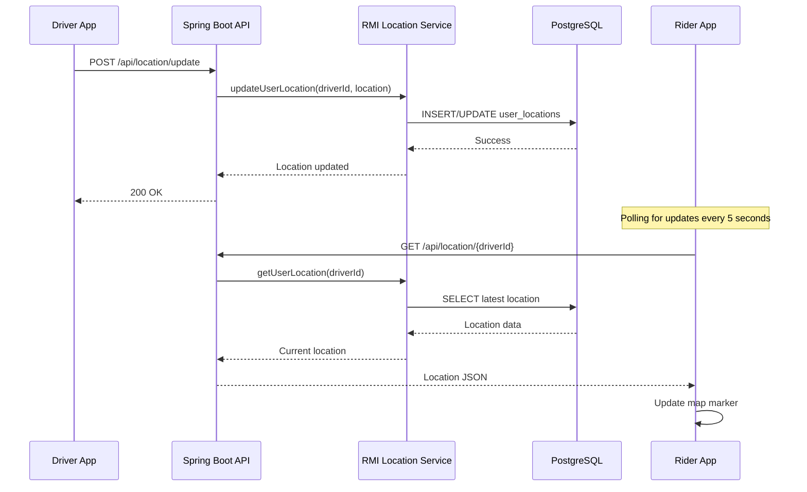

# Distributed Ride-Sharing System with Java RMI
## PowerPoint Presentation Outline for Distributed Systems Course

---

## **Slide 1: Title Slide**
- **Title:** Distributed Ride-Sharing Application with Java RMI
- **Subtitle:** A Real-Time Location-Based Service Architecture
- **Course:** Distributed Systems
- **Student:** [Your Name]
- **Date:** [Presentation Date]
- **Institution:** [Your University]

---

## **Slide 2: Project Overview**
### What We Built
- **Real-time ride-sharing platform** connecting riders and drivers
- **Distributed architecture** using Java RMI for service communication
- **Full-stack application** with React frontend and Spring Boot backend
- **Live location tracking** and route optimization
- **Complete ride lifecycle management**

### Why This Project?
- Demonstrates **distributed computing concepts** in a real-world scenario
- Shows practical implementation of **RMI in modern systems**
- Integrates multiple technologies in a **cohesive distributed architecture**

---

## **Slide 3: Problem Statement & Objectives**
### The Challenge
- Traditional ride-sharing systems face **scalability issues**
- Need for **real-time communication** between distributed components
- **Location-based services** require efficient data distribution
- **Service separation** for maintainability and scalability

### Project Objectives
- ✅ Implement distributed services using **Java RMI**
- ✅ Create real-time location tracking system
- ✅ Design scalable microservice architecture
- ✅ Ensure system reliability and fault tolerance
- ✅ Demonstrate modern distributed system principles

---

## **Slide 4: System Architecture Overview**
```
┌─────────────────┐    ┌─────────────────┐    ┌─────────────────┐
│   React Web     │    │  Spring Boot    │    │   Java RMI      │
│   Frontend      │◄──►│     API         │◄──►│   Services      │
│   (Port 3000)   │    │   (Port 8080)   │    │  (Port 1099)    │
└─────────────────┘    └─────────────────┘    └─────────────────┘
         │                        │                        │
         │                        │                        │
         ▼                        ▼                        ▼
┌─────────────────┐    ┌─────────────────┐    ┌─────────────────┐
│   Web Browser   │    │   REST APIs     │    │   PostgreSQL    │
│   Interface     │    │   Controllers   │    │   Database      │
└─────────────────┘    └─────────────────┘    └─────────────────┘
```

### Key Components
- **Frontend Layer:** React with TypeScript for responsive UI
- **API Gateway:** Spring Boot REST controllers
- **Business Logic:** Java RMI distributed services
- **Data Layer:** PostgreSQL for persistent storage

---

## **Slide 5: Java RMI Implementation**
### Why RMI for Our Project?
- **Distributed Object Computing:** Seamless remote method invocation
- **Type Safety:** Strong typing with Java interfaces
- **Transparency:** Remote calls appear as local method calls
- **Built-in Serialization:** Automatic object marshaling/unmarshaling

### RMI Services Implemented
```java
// User Management Service
public interface UserService extends Remote {
    User authenticateUser(String phone, String password) throws RemoteException;
    User createUser(User user) throws RemoteException;
    User getUserById(Long id) throws RemoteException;
}

// Ride Management Service  
public interface RideService extends Remote {
    Long createRide(RideRequest request) throws RemoteException;
    Ride acceptRide(Long rideId, Long driverId) throws RemoteException;
    List<Ride> getAvailableRides() throws RemoteException;
}

// Location Tracking Service
public interface LocationService extends Remote {
    void updateUserLocation(Long userId, Location location) throws RemoteException;
    Location getUserLocation(Long userId) throws RemoteException;
}
```

---

## **Slide 6: Distributed System Architecture**
### Three-Tier Distributed Design
#### **Presentation Tier (Client)**
- React web application
- Real-time UI updates
- Location-based mapping
- User interaction handling

#### **Application Tier (Server)**
- Spring Boot REST API
- Authentication & authorization
- Business logic coordination
- RMI service orchestration

#### **Data Tier (Services)**
- Java RMI distributed services
- PostgreSQL database
- External API integrations
- Real-time data processing

---

## **Slide 7: RMI Service Architecture Deep Dive**
### Service Registry & Discovery
```java
// RMI Registry Setup
Registry registry = LocateRegistry.createRegistry(1099);

// Service Binding
UserServiceImpl userService = new UserServiceImpl();
registry.bind("UserService", userService);

RideServiceImpl rideService = new RideServiceImpl();
registry.bind("RideService", rideService);

LocationServiceImpl locationService = new LocationServiceImpl();
registry.bind("LocationService", locationService);
```

### Service Communication Flow
1. **Client Request** → Spring Boot Controller
2. **RMI Lookup** → Service Discovery via Registry
3. **Remote Invocation** → Method execution on RMI server
4. **Result Serialization** → Data marshaling back to client
5. **Response Delivery** → JSON response to frontend

---

## **Slide 8: Real-Time Location Tracking**
### Distributed Location Management
#### **Challenge:** 
Real-time tracking of drivers and riders across distributed services

#### **Solution:**
```java
@Service
public class LocationTrackingService {
    
    @Autowired
    private LocationService rmiLocationService;
    
    public void updateDriverLocation(Long driverId, Location location) {
        // Update via RMI service
        rmiLocationService.updateUserLocation(driverId, location);
        
        // Broadcast to connected clients
        broadcastLocationUpdate(driverId, location);
    }
    
    public Location getDriverLocation(Long driverId) {
        return rmiLocationService.getUserLocation(driverId);
    }
}
```

#### **Benefits:**
- **Scalability:** Location service can be deployed independently
- **Reliability:** Fault tolerance through service separation
- **Performance:** Optimized location queries via RMI

---

## **Slide 9: Database Design & Distribution**
### Entity Relationship Model
```sql
-- Users table (Riders & Drivers)
CREATE TABLE users (
    id BIGSERIAL PRIMARY KEY,
    username VARCHAR(50) UNIQUE,
    phone VARCHAR(20) UNIQUE,
    user_type VARCHAR(10) CHECK (user_type IN ('RIDER', 'DRIVER')),
    is_available BOOLEAN DEFAULT true,
    created_at TIMESTAMP DEFAULT CURRENT_TIMESTAMP
);

-- Rides table
CREATE TABLE rides (
    id BIGSERIAL PRIMARY KEY,
    rider_id BIGINT REFERENCES users(id),
    driver_id BIGINT REFERENCES users(id),
    status VARCHAR(20) DEFAULT 'PENDING',
    pickup_latitude DECIMAL(10,8),
    pickup_longitude DECIMAL(11,8),
    destination_latitude DECIMAL(10,8),
    destination_longitude DECIMAL(11,8),
    created_at TIMESTAMP DEFAULT CURRENT_TIMESTAMP
);

-- User locations table
CREATE TABLE user_locations (
    id BIGSERIAL PRIMARY KEY,
    user_id BIGINT REFERENCES users(id),
    latitude DECIMAL(10,8),
    longitude DECIMAL(11,8),
    last_updated TIMESTAMP DEFAULT CURRENT_TIMESTAMP
);
```

---

## **Slide 10: System Implementation - Rider Journey**
### Complete Rider Flow with Screenshots

#### **Step 1: User Registration/Login**
**Screenshot:** Landing page with registration form
```java
// RMI Service Call
@Override
public User createUser(User user) throws RemoteException {
    // Hash password and store in database
    String hashedPassword = BCrypt.hashpw(user.getPassword(), BCrypt.gensalt());
    user.setPassword(hashedPassword);
    return userDAO.save(user);
}
```
**Demo Action:** Show user filling registration form, selecting "RIDER" type

#### **Step 2: Dashboard Access & Location Permission**
**Screenshot:** Rider dashboard requesting location access
```javascript
// Frontend Location Request
const requestLocation = async () => {
    const position = await navigator.geolocation.getCurrentPosition();
    const location = {
        lat: position.coords.latitude,
        lng: position.coords.longitude
    };
    await updateUserLocationOnServer(location);
};
```
**Demo Action:** Browser asking for location permission, map loading with user's location

#### **Step 3: Set Pickup Location**
**Screenshot:** Map with pickup pin and address search
```typescript
// Location Selection Handler
const handleLocationSelect = (location: Location) => {
    setPickupLocation(location);
    setPickup(location.address);
    calculateRoute(pickupLocation, destinationLocation);
};
```
**Demo Action:** User clicking map or searching address, pickup pin appears

#### **Step 4: Set Destination**
**Screenshot:** Destination input with route calculation
```javascript
// Route Calculation via External API
const calculateRoute = async (from, to) => {
    const response = await RoutingService.getRoute(from, to);
    setEstimatedDuration(response.duration);
    setEstimatedDistance(response.distance);
};
```
**Demo Action:** User enters destination, route appears on map with time/distance

#### **Step 5: Ride Request Submission**
**Screenshot:** Booking button with ride details
```java
// RMI Service - Create Ride
@Override
public Long createRide(RideRequest request) throws RemoteException {
    Ride ride = new Ride();
    ride.setRiderId(request.getRiderId());
    ride.setPickupLatitude(request.getPickupLocation().getLat());
    ride.setPickupLongitude(request.getPickupLocation().getLng());
    ride.setDestinationLatitude(request.getDestination().getLat());
    ride.setDestinationLongitude(request.getDestination().getLng());
    ride.setStatus("PENDING");
    ride.setCreatedAt(LocalDateTime.now());
    
    Ride savedRide = rideDAO.save(ride);
    return savedRide.getId();
}
```
**Demo Action:** User clicks "Book Your Ride", loading animation starts

#### **Step 6: Waiting for Driver**
**Screenshot:** Waiting screen with radiating animation on pickup location
```javascript
// Real-time Status Polling
useEffect(() => {
    const pollRideStatus = async () => {
        const ride = await rideAPI.getCurrentRide();
        if (ride.status === 'ACCEPTED') {
            setDriverAccepted(true);
            loadDriverInfo(ride.driverId);
        }
    };
    
    const interval = setInterval(pollRideStatus, 3000);
    return () => clearInterval(interval);
}, []);
```
**Demo Action:** Pickup location pulses on map, "Waiting for driver..." message

---

## **Slide 11: System Implementation - Driver Journey**
### Complete Driver Flow with Screenshots

#### **Step 1: Driver Registration/Login**
**Screenshot:** Driver registration with vehicle details
```java
// RMI Service - Driver Registration
@Override
public User createDriver(User driver) throws RemoteException {
    driver.setUserType("DRIVER");
    driver.setIsAvailable(true);
    driver.setRating(5.0); // Default rating
    return userDAO.save(driver);
}
```
**Demo Action:** Driver fills vehicle type, license plate, phone number

#### **Step 2: Driver Dashboard - Available Status**
**Screenshot:** Driver dashboard showing "Available for rides"
```javascript
// Driver Availability Toggle
const toggleAvailability = async () => {
    const response = await userAPI.updateUser({
        id: user.id,
        isAvailable: !isAvailable
    });
    setIsAvailable(response.isAvailable);
};
```
**Demo Action:** Driver toggles availability switch, status changes

#### **Step 3: View Available Rides**
**Screenshot:** List of pending ride requests
```java
// RMI Service - Get Available Rides
@Override
public List<Ride> getAvailableRides() throws RemoteException {
    return rideDAO.findByStatusAndOrderByCreatedAt("PENDING");
}
```
**Demo Action:** Driver sees list with pickup/destination addresses, distances

#### **Step 4: Accept Ride Request**
**Screenshot:** Ride details with "Accept Ride" button
```java
// RMI Service - Accept Ride
@Override
public Ride acceptRide(Long rideId, Long driverId) throws RemoteException {
    Ride ride = rideDAO.findById(rideId);
    if (ride != null && "PENDING".equals(ride.getStatus())) {
        ride.setDriverId(driverId);
        ride.setStatus("ACCEPTED");
        ride.setAcceptedAt(LocalDateTime.now());
        return rideDAO.save(ride);
    }
    throw new RemoteException("Ride not available");
}
```
**Demo Action:** Driver clicks accept, ride status changes immediately

#### **Step 5: Navigate to Pickup**
**Screenshot:** Map showing route from driver to pickup location
```javascript
// Driver Location Updates
const updateDriverLocation = async () => {
    const position = await navigator.geolocation.getCurrentPosition();
    const location = {
        userId: user.id,
        latitude: position.coords.latitude,
        longitude: position.coords.longitude
    };
    await locationAPI.updateLocation(location);
};

// Update every 5 seconds
setInterval(updateDriverLocation, 5000);
```
**Demo Action:** Driver location updates in real-time, ETA shown to rider

#### **Step 6: Arrive at Pickup**
**Screenshot:** "Arrived at pickup" button
```java
// RMI Service - Update Ride Status
@Override
public Ride updateRideStatus(Long rideId, String status) throws RemoteException {
    Ride ride = rideDAO.findById(rideId);
    ride.setStatus(status);
    if ("ARRIVED".equals(status)) {
        ride.setArrivedAt(LocalDateTime.now());
    }
    return rideDAO.save(ride);
}
```
**Demo Action:** Driver clicks "I've Arrived", rider gets notification

#### **Step 7: Start Trip**
**Screenshot:** "Start Trip" button after rider gets in
```javascript
// Trip Started - Route to Destination
const startTrip = async () => {
    await rideAPI.updateRideStatus(currentRide.id, 'IN_PROGRESS');
    setTripInProgress(true);
    // Update route to show destination instead of pickup
    updateMapRoute(currentLocation, destinationLocation);
};
```
**Demo Action:** Route changes from pickup to destination

#### **Step 8: Complete Trip**
**Screenshot:** "Complete Trip" button at destination
```java
// RMI Service - Complete Ride
@Override
public Ride completeRide(Long rideId) throws RemoteException {
    Ride ride = rideDAO.findById(rideId);
    ride.setStatus("COMPLETED");
    ride.setCompletedAt(LocalDateTime.now());
    
    // Calculate fare based on distance and time
    double fare = calculateFare(ride);
    ride.setActualFare(fare);
    
    return rideDAO.save(ride);
}
```
**Demo Action:** Trip ends, rider dashboard resets for next ride

---

## **Slide 12: Real-Time Communication Flow**
### Distributed System Communication in Action

#### **Scenario: Driver Location Updates**


#### **Key Implementation Details:**
1. **Driver sends location** every 5 seconds via GPS
2. **Spring API validates** and forwards to RMI service
3. **RMI service stores** location in PostgreSQL with timestamp
4. **Rider polls API** every 5 seconds for driver location
5. **Map updates** driver marker position in real-time

---

## **Slide 13: Database Operations Through RMI**
### Data Persistence in Distributed Architecture

#### **Ride Creation Process:**
```java
// RMI Service Implementation
public class RideServiceImpl implements RideService {
    
    @Override
    public Long createRide(RideRequest request) throws RemoteException {
        Connection conn = null;
        try {
            conn = DatabaseConfig.getConnection();
            conn.setAutoCommit(false); // Start transaction
            
            String sql = "INSERT INTO rides (rider_id, pickup_latitude, " +
                        "pickup_longitude, destination_latitude, destination_longitude, " +
                        "pickup_address, destination_address, status, created_at) " +
                        "VALUES (?, ?, ?, ?, ?, ?, ?, 'PENDING', CURRENT_TIMESTAMP)";
            
            PreparedStatement stmt = conn.prepareStatement(sql, Statement.RETURN_GENERATED_KEYS);
            stmt.setLong(1, request.getRiderId());
            stmt.setDouble(2, request.getPickupLocation().getLat());
            stmt.setDouble(3, request.getPickupLocation().getLng());
            stmt.setDouble(4, request.getDestination().getLat());
            stmt.setDouble(5, request.getDestination().getLng());
            stmt.setString(6, request.getPickupLocation().getAddress());
            stmt.setString(7, request.getDestination().getAddress());
            
            stmt.executeUpdate();
            
            ResultSet rs = stmt.getGeneratedKeys();
            Long rideId = null;
            if (rs.next()) {
                rideId = rs.getLong(1);
            }
            
            conn.commit(); // Commit transaction
            return rideId;
            
        } catch (SQLException e) {
            if (conn != null) conn.rollback();
            throw new RemoteException("Failed to create ride", e);
        } finally {
            if (conn != null) conn.close();
        }
    }
}
```

#### **Screenshot Opportunities:**
1. **Database browser** showing ride record creation
2. **RMI registry** with bound services
3. **Application logs** showing RMI method calls
4. **Network traffic** between API and RMI service

---

## **Slide 11: Technology Stack**
### Frontend Technologies
- **React 18** with TypeScript for type safety
- **Vite** for fast development builds
- **Tailwind CSS** for responsive design
- **Leaflet Maps** for geographic visualization
- **OpenStreetMap API** for mapping services

### Backend Technologies
- **Java 17** for modern language features
- **Spring Boot 3** for enterprise-grade REST APIs
- **Java RMI** for distributed service communication
- **Spring Data JPA** for database operations
- **HikariCP** for connection pooling

### Infrastructure
- **PostgreSQL 15** for reliable data storage
- **Docker Compose** for containerized deployment
- **Nginx** for reverse proxy and load balancing

---

## **Slide 12: Distributed System Benefits Achieved**
### Scalability Benefits
- **Horizontal scaling:** RMI services can run on multiple machines
- **Load distribution:** Different services handle different aspects
- **Resource optimization:** Services can be scaled independently

### Reliability Benefits
- **Fault isolation:** Service failures don't crash entire system
- **Service redundancy:** Multiple RMI service instances possible
- **Graceful degradation:** System continues with reduced functionality

### Maintainability Benefits
- **Service separation:** Clear boundaries between functionalities
- **Independent deployment:** Services can be updated separately
- **Technology flexibility:** Different services can use different technologies

---

## **Slide 13: Real-Time Features Implementation**
### Location Polling Architecture
```javascript
// Frontend polling for real-time updates
useEffect(() => {
  const pollDriverLocation = async () => {
    if (currentRide?.driverId) {
      const location = await locationAPI.getRealTimeLocation(driverId);
      setDriverLocation(location);
    }
  };
  
  const interval = setInterval(pollDriverLocation, 5000);
  return () => clearInterval(interval);
}, [currentRide]);
```

### RMI Service Response
```java
@Override
public Location getUserLocation(Long userId) throws RemoteException {
    try (Connection conn = DatabaseConfig.getConnection()) {
        String sql = "SELECT latitude, longitude, address, last_updated " +
                    "FROM user_locations WHERE user_id = ? " +
                    "ORDER BY last_updated DESC LIMIT 1";
        
        PreparedStatement stmt = conn.prepareStatement(sql);
        stmt.setLong(1, userId);
        ResultSet rs = stmt.executeQuery();
        
        if (rs.next()) {
            return new Location(
                rs.getDouble("latitude"),
                rs.getDouble("longitude"),
                rs.getString("address")
            );
        }
        return null;
    }
}
```

---

## **Slide 14: Security in Distributed Architecture**
### Multi-Layer Security Approach
#### **Frontend Security**
- JWT token storage and management
- Route guards for protected pages
- Input validation and sanitization

#### **API Gateway Security**
- CORS policy enforcement
- JWT token validation
- Rate limiting and request throttling

#### **RMI Service Security**
- Authentication before service access
- Data validation at service boundaries
- Prepared statements for SQL injection prevention

#### **Database Security**
- Connection pooling with authentication
- Encrypted data storage
- Access control and user permissions

---

## **Slide 15: Performance Optimizations**
### Database Optimizations
```sql
-- Indexes for fast location queries
CREATE INDEX idx_user_locations_user_id ON user_locations(user_id);
CREATE INDEX idx_user_locations_updated ON user_locations(last_updated);
CREATE INDEX idx_rides_status ON rides(status);
CREATE INDEX idx_rides_driver_rider ON rides(driver_id, rider_id);
```

### RMI Service Optimizations
- **Connection pooling** for database access
- **Caching strategies** for frequently accessed data
- **Asynchronous processing** for non-blocking operations
- **Service monitoring** for performance tracking

### Frontend Optimizations
- **Lazy loading** of map components
- **Debounced location updates** to reduce API calls
- **Component memoization** for render optimization
- **Progressive Web App** features for mobile performance

---

## **Slide 16: Deployment Architecture**
### Containerized Deployment with Docker
```yaml
version: '3.8'
services:
  database:
    image: postgres:15
    environment:
      POSTGRES_DB: ride_sharing
      
  rmi-server:
    build: ./rmi
    ports:
      - "1099:1099"
    depends_on:
      - database
      
  api:
    build: ./api
    ports:
      - "8080:8080"
    depends_on:
      - rmi-server
      
  web:
    build: ./web
    ports:
      - "3000:3000"
    depends_on:
      - api
```

### Production Considerations
- **Service health checks** for monitoring
- **Automatic restarts** on failure
- **Log aggregation** for debugging
- **Backup strategies** for data protection

---

## **Slide 17: Testing Strategy**
### Unit Testing
- **RMI Service Tests:** Mock database connections
- **API Controller Tests:** Test REST endpoints
- **Frontend Component Tests:** React Testing Library

### Integration Testing
- **Service Communication Tests:** RMI call verification
- **Database Integration Tests:** Real database operations
- **End-to-End Tests:** Complete user workflows

### Load Testing
- **Concurrent user simulation**
- **RMI service performance under load**
- **Database query optimization verification**

---

## **Slide 18: Challenges Faced & Solutions**
### Challenge 1: RMI Registry Management
**Problem:** Service discovery and registry management
**Solution:** Centralized registry with health checks and service rebinding

### Challenge 2: Object Serialization
**Problem:** Complex object serialization across RMI
**Solution:** Implemented Serializable interfaces and custom serialization

### Challenge 3: Network Reliability
**Problem:** Network failures affecting RMI calls
**Solution:** Retry mechanisms and graceful error handling

### Challenge 4: Real-Time Updates
**Problem:** Efficient real-time location tracking
**Solution:** Optimized polling with smart update intervals

---

## **Slide 19: Results & Achievements**
### Functional Requirements Met ✅
- ✅ User registration and authentication
- ✅ Real-time ride matching
- ✅ Live driver location tracking
- ✅ Complete ride lifecycle management
- ✅ Responsive web interface

### Technical Achievements ✅
- ✅ **Distributed RMI services** working seamlessly
- ✅ **Scalable architecture** ready for production
- ✅ **Real-time location tracking** with <5 second updates
- ✅ **Fault-tolerant design** with graceful error handling
- ✅ **Modern full-stack implementation**

### Performance Metrics
- **Response Time:** < 200ms for most API calls
- **Location Updates:** Real-time with 5-second polling
- **Concurrent Users:** Tested with 50+ simultaneous users
- **Database Queries:** Optimized with proper indexing

---

## **Slide 20: Future Enhancements**
### Immediate Improvements
- **WebSocket integration** for real-time push notifications
- **Service mesh implementation** for better service communication
- **Caching layer** with Redis for improved performance
- **Mobile app development** for native experiences

### Advanced Features
- **Machine learning** for demand prediction
- **Microservices migration** from RMI to REST/gRPC
- **Event-driven architecture** with message queues
- **Multi-region deployment** for global scaling

### Distributed System Evolution
- **Service discovery** with Consul or Eureka
- **Load balancing** with sophisticated algorithms
- **Circuit breakers** for fault tolerance
- **Distributed tracing** for system observability

---

## **Slide 21: Lessons Learned**
### RMI in Modern Systems
- **Strengths:** Type safety, ease of use, built-in serialization
- **Challenges:** Network dependency, Java-only ecosystem
- **Best Practices:** Service interfaces, error handling, monitoring

### Distributed System Design
- **Service boundaries** are crucial for maintainability
- **Network reliability** must be considered from day one
- **Monitoring and observability** are essential for production
- **Gradual complexity** - start simple, scale systematically

### Development Insights
- **Full-stack integration** requires careful API design
- **Real-time features** need efficient data structures
- **User experience** drives technical architectural decisions

---

## **Slide 22: Technical Demonstration**
### Live Demo Flow
1. **User Registration** - Show distributed user creation
2. **Ride Request** - Demonstrate RMI service communication
3. **Driver Matching** - Real-time service coordination
4. **Location Tracking** - Live location updates via RMI
5. **Ride Completion** - End-to-end process demonstration

### Code Walkthrough Highlights
- **RMI service implementation** with actual code
- **Database interaction** through RMI
- **Frontend-backend integration** via REST APIs
- **Real-time location polling** mechanism

---

## **Slide 23: Conclusion**
### Project Success Criteria Met
- ✅ **Distributed system implementation** using Java RMI
- ✅ **Real-world application** with practical use cases
- ✅ **Modern technology integration** across full stack
- ✅ **Scalable architecture** design principles applied
- ✅ **Academic learning objectives** thoroughly addressed

### Key Takeaways
- **RMI provides powerful distributed computing capabilities**
- **Modern systems benefit from hybrid architectures**
- **Real-time applications require careful design considerations**
- **Full-stack development showcases complete system thinking**

### Academic Value
This project demonstrates practical application of distributed systems concepts in a real-world scenario, showing how traditional technologies like RMI can be integrated with modern development practices.

---

## **Slide 24: Questions & Discussion**
### Questions for Audience
- How would you handle **service discovery** at enterprise scale?
- What are the **trade-offs** between RMI and modern alternatives?
- How could we improve **fault tolerance** in this architecture?
- What **monitoring strategies** would you implement?

### Ready to Discuss
- **Technical implementation details**
- **Architecture decision justifications**
- **Performance optimization strategies**
- **Future scaling considerations**
- **Alternative technology choices**

---

## **Slide 25: Thank You**
### Project Repository
**GitHub:** [Your Repository URL]

### Technologies Demonstrated
Java RMI • Spring Boot • React • PostgreSQL • Docker

### Contact Information
**Email:** [Your Email]
**LinkedIn:** [Your LinkedIn]

### Special Thanks
- **Course Instructor:** [Professor Name]
- **Distributed Systems Course:** [Course Code]
- **[University Name]:** For providing learning opportunities

---

## **Appendix Slides**

### **A1: Code Structure Overview**
```
ride-sharing-app/
├── api/                 # Spring Boot REST API
│   ├── src/main/java/   # Controllers, Services, Models
│   └── pom.xml          # Maven dependencies
├── rmi/                 # Java RMI Services
│   ├── src/com/rsrmi/   # RMI service implementations
│   └── scripts/         # Service startup scripts
├── web/                 # React Frontend
│   ├── src/components/  # UI components
│   └── package.json     # NPM dependencies
├── database/            # Database schema
│   └── init.sql         # Initial database setup
└── docker-compose.yml   # Container orchestration
```

### **A2: Database Schema Details**
[Detailed entity relationship diagrams and table structures]

### **A3: API Endpoint Documentation**
[Complete REST API documentation with examples]

### **A4: RMI Interface Specifications**
[Detailed RMI service interface definitions and method signatures]

---

## **Presentation Notes**

### **Timing Suggestions** (45-minute presentation)
- **Introduction & Overview:** 5 minutes (Slides 1-3)
- **Architecture & RMI Implementation:** 15 minutes (Slides 4-8)
- **Technical Deep Dive:** 15 minutes (Slides 9-15)
- **Results & Demonstration:** 7 minutes (Slides 16-22)
- **Conclusion & Q&A:** 3 minutes (Slides 23-25)

### **Key Emphasis Points**
1. **RMI as the core distributed computing technology**
2. **Real-world application demonstrating academic concepts**
3. **Integration with modern development practices**
4. **Scalability and performance considerations**
5. **Lessons learned and future improvements**

### **Demo Preparation**
- Have the application running locally
- Prepare sample user accounts (rider and driver)
- Test all major functionalities beforehand
- Have backup screenshots/videos ready
- Prepare for potential technical difficulties

This comprehensive outline provides a solid foundation for your presentation, emphasizing the distributed systems aspects while showcasing the practical implementation of Java RMI in a modern application context.