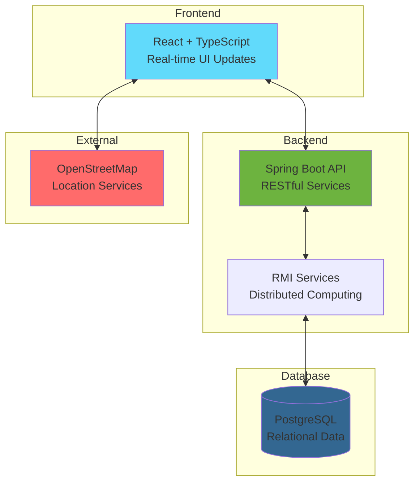
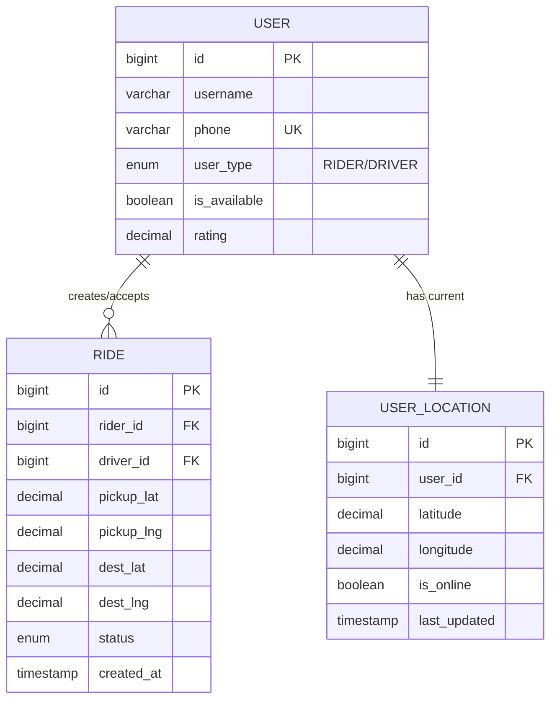

# Ride-Sharing Application - Academic Presentation

## Project Overview

A comprehensive ride-sharing application built with modern web technologies, demonstrating full-stack development, real-time communication, and distributed systems architecture.

## Quick System Summary

## Key Features Implemented

### 🚀 **Core Functionality**
- **User Authentication**: Secure login/registration for riders and drivers
- **Ride Management**: Complete ride lifecycle from request to completion
- **Real-time Tracking**: Live driver location updates for riders
- **Map Integration**: Interactive maps with routing and geocoding
- **Status Management**: Real-time ride status updates and notifications

### 🔧 **Technical Features**
- **Responsive Design**: Works on desktop and mobile browsers
- **Real-time Communication**: Polling-based location updates
- **Geographic Services**: Address geocoding and route calculation
- **State Management**: React Context for global application state
- **API Integration**: RESTful backend with Spring Boot
- **Database Design**: Normalized PostgreSQL schema

## Technology Stack

| Layer | Technology | Purpose |
|-------|------------|---------|
| **Frontend** | React 18 + TypeScript | Interactive user interface |
| **Styling** | Tailwind CSS | Responsive design system |
| **Maps** | Leaflet + OpenStreetMap | Geographic visualization |
| **Backend** | Spring Boot 3 | REST API and business logic |
| **Middleware** | Java RMI | Distributed service layer |
| **Database** | PostgreSQL 15 | Data persistence |
| **Build Tools** | Vite, Maven | Development and build process |
| **Containerization** | Docker Compose | Development environment |

## System Architecture Highlights

### 🏗️ **Three-Tier Architecture**
1. **Presentation Layer**: React frontend with responsive design
2. **Business Logic Layer**: Spring Boot API with RMI services
3. **Data Layer**: PostgreSQL with optimized schema design

### 🔄 **Real-time Features**
- **Location Tracking**: Driver positions updated every 5 seconds
- **Status Updates**: Immediate ride status notifications
- **Map Updates**: Dynamic marker and route updates
- **Browser Notifications**: Alert system for important events

### 🛡️ **Security Implementation**
- **JWT Authentication**: Secure token-based authentication
- **Role-based Access**: Separate driver and rider permissions
- **Input Validation**: Frontend and backend data validation
- **SQL Injection Prevention**: Parameterized queries and ORM

## Database Design

## API Endpoints Overview

### Authentication
- `POST /api/v1/users/login` - User authentication
- `POST /api/v1/users/register` - User registration

### Ride Management
- `POST /api/v1/rides/request` - Create ride request
- `GET /api/v1/rides/current` - Get active ride
- `GET /api/v1/rides/available` - Get available rides (drivers)
- `POST /api/v1/rides/{id}/accept` - Accept ride (drivers)

### Location Services
- `PUT /api/v1/users/update/location` - Update user location
- `GET /api/v1/users/{id}/get/location` - Get real-time location

## Development Achievements

### 📱 **Frontend Development**
- **Modern React**: Hooks, Context API, TypeScript integration
- **Responsive Design**: Mobile-first approach with Tailwind CSS
- **Map Integration**: Interactive maps with real-time updates
- **State Management**: Centralized application state
- **Error Handling**: Comprehensive error boundaries and validation

### ⚙️ **Backend Development**
- **RESTful API**: Clean API design with proper HTTP methods
- **RMI Integration**: Distributed computing implementation
- **Database Design**: Normalized schema with proper relationships
- **Security**: JWT authentication and role-based access control
- **Error Handling**: Comprehensive exception handling

### 🔌 **System Integration**
- **External APIs**: OpenStreetMap, geocoding, routing services
- **Real-time Updates**: Polling-based location tracking
- **Cross-platform**: Web application working across devices
- **Containerization**: Docker-based development environment

## Demonstration Flow

### 1. **User Registration & Login**
- Show rider and driver registration
- Demonstrate role-based dashboard access

### 2. **Ride Request Process**
- Rider sets pickup and destination
- Real-time ride request submission
- Waiting state with loading indicators

### 3. **Driver Acceptance**
- Driver views available rides
- Ride acceptance process
- Automatic location sharing activation

### 4. **Real-time Tracking**
- Live driver location on rider's map
- Distance calculations and updates
- Status progression through ride phases

### 5. **Ride Completion**
- Trip progression monitoring
- Completion process
- System state reset

## Academic Learning Outcomes

### 🎓 **Software Engineering Principles**
- **Requirements Analysis**: User story mapping and feature specification
- **System Design**: Multi-tier architecture and component design
- **Implementation**: Full-stack development with modern technologies
- **Testing**: Component testing and integration testing
- **Documentation**: Comprehensive system documentation

### 🔬 **Technical Concepts Demonstrated**
- **Web Development**: Modern frontend and backend development
- **Database Systems**: Relational database design and optimization
- **Distributed Systems**: RMI-based service architecture
- **Geographic Information Systems**: Map integration and location services
- **Real-time Systems**: Live data updates and synchronization
- **Security**: Authentication, authorization, and data protection

### 📊 **Project Management**
- **Version Control**: Git-based development workflow
- **Development Environment**: Docker containerization
- **Code Organization**: Modular architecture and clean code principles
- **Deployment**: Production-ready deployment configuration

## Future Enhancements

### 🚀 **Scalability Improvements**
- Microservices architecture migration
- Real-time WebSocket communication
- Caching layer implementation
- Load balancing and horizontal scaling

### 📱 **Feature Expansions**
- Mobile app development (React Native)
- Payment integration
- Advanced routing algorithms
- Machine learning for demand prediction

### 🔧 **Technical Improvements**
- Automated testing suite
- CI/CD pipeline implementation
- Performance monitoring
- Advanced security features

---

## Conclusion

This ride-sharing application demonstrates a comprehensive understanding of modern web development principles, showcasing the integration of frontend technologies, backend services, database design, and external API integration. The project successfully implements real-time features, secure authentication, and responsive design while maintaining clean architecture and scalable code organization.

The application serves as a practical example of full-stack development skills, system design capabilities, and the ability to integrate multiple technologies to create a functional, user-friendly solution that addresses real-world transportation needs.