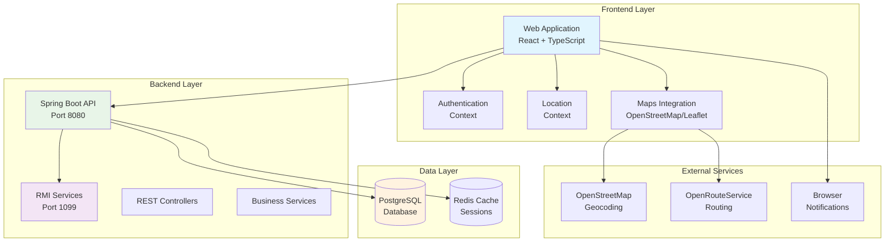
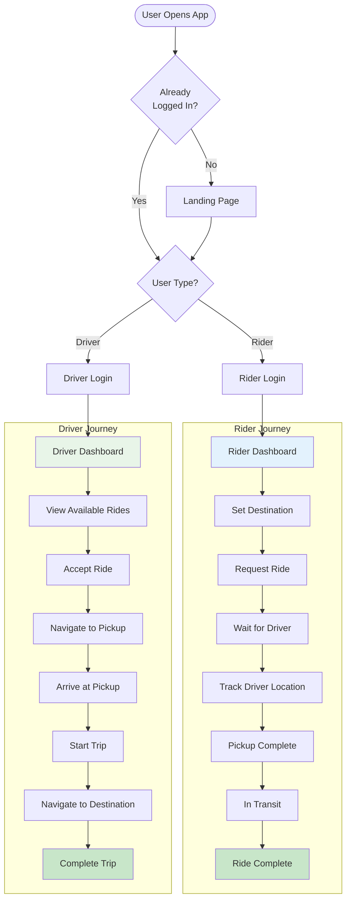
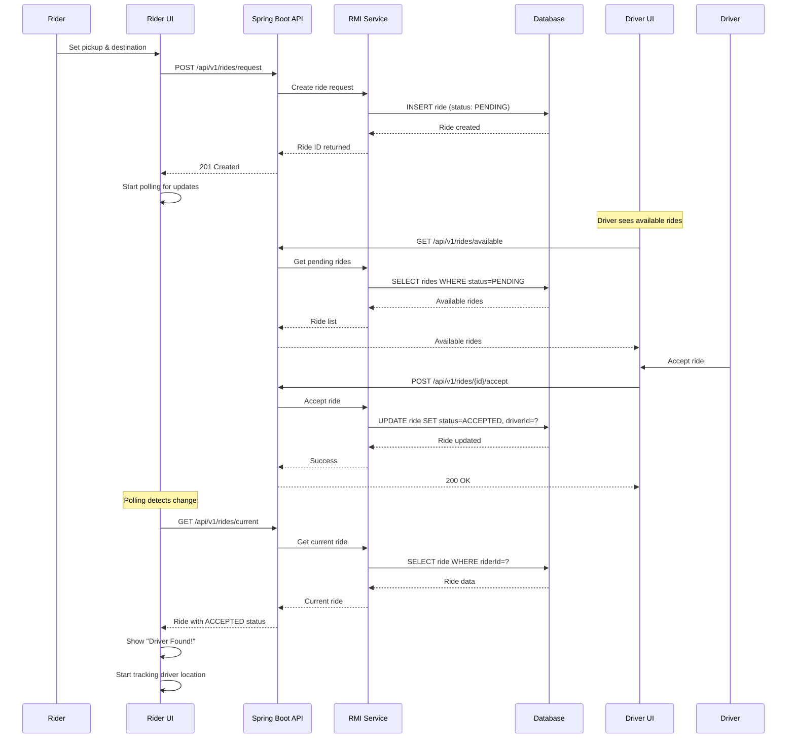
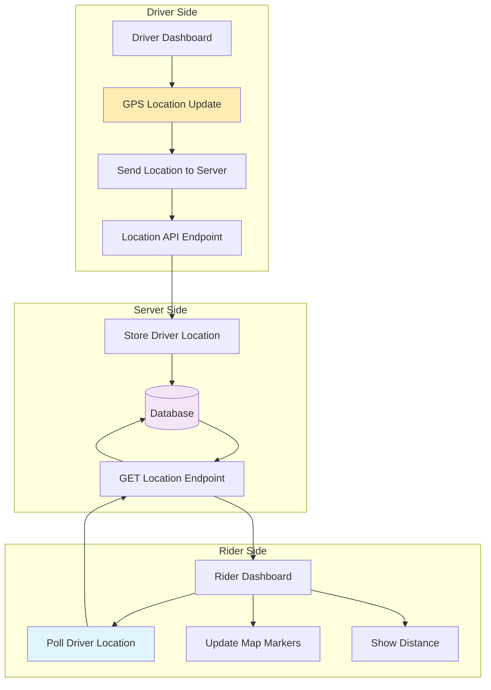
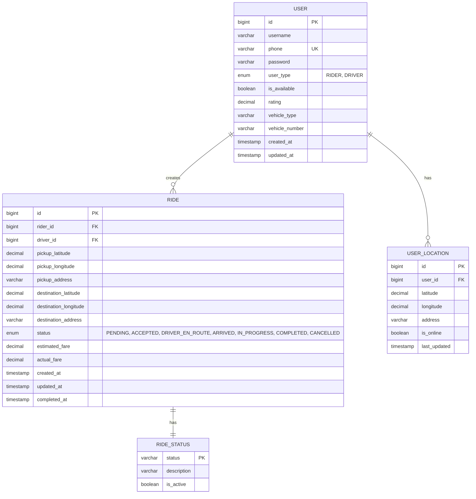
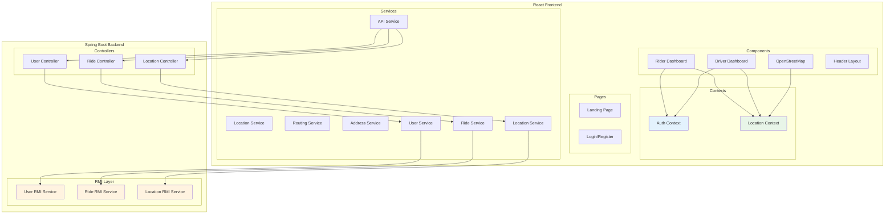
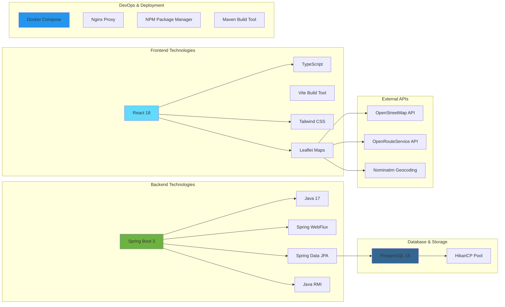
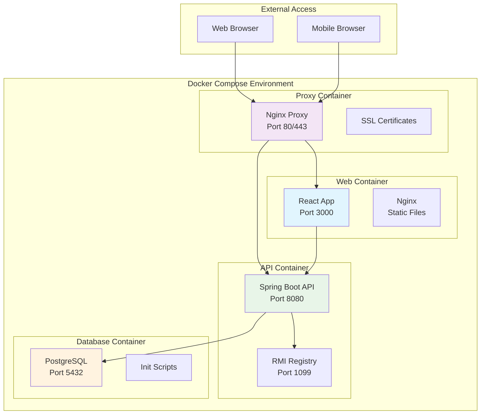
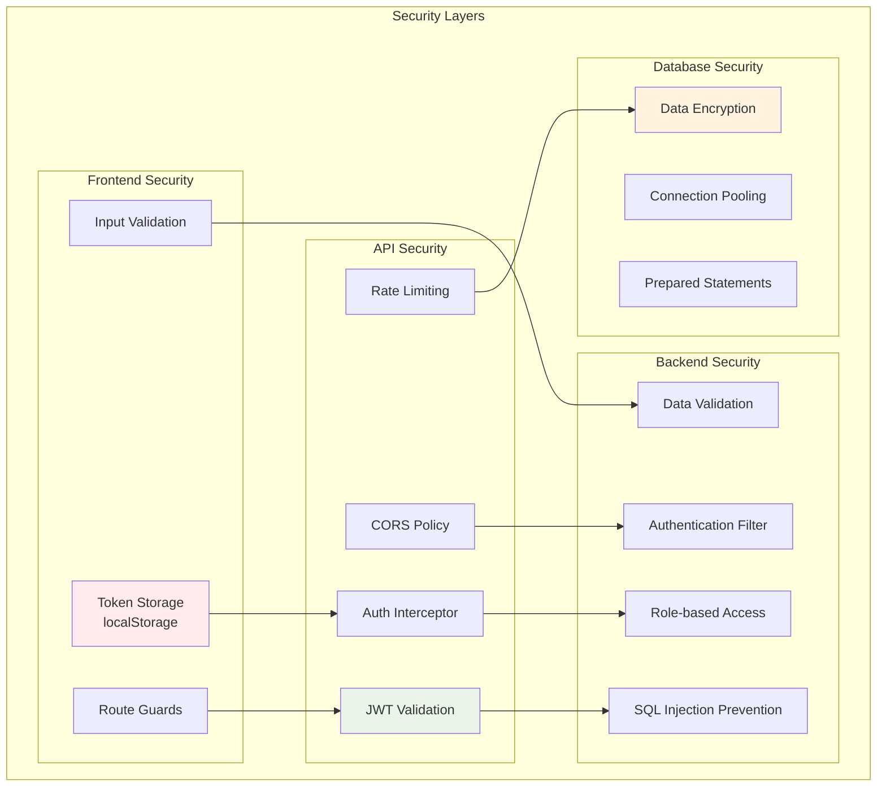

# Ride-Sharing Application System Diagrams

This document contains comprehensive system diagrams for the ride-sharing application suitable for academic presentation.

## 1. System Architecture Overview



## 2. User Flow Diagram



## 3. Ride Request Sequence Diagram



## 4. Real-time Location Tracking Flow



## 5. Database Entity Relationship Diagram



## 6. Component Architecture Diagram



## 7. API Endpoint Overview

```mermaid
mindmap
  root((REST API Endpoints))
    Authentication
      POST /api/v1/users/login
      POST /api/v1/users/register
      POST /api/v1/users/logout
    User Management
      GET /api/v1/users/get
      PUT /api/v1/users/update
      PUT /api/v1/users/update/location
      GET /api/v1/users/{id}/get/location
    Ride Management
      POST /api/v1/rides/request
      GET /api/v1/rides/current
      GET /api/v1/rides/available
      POST /api/v1/rides/{id}/accept
      PUT /api/v1/rides/{id}/status
      DELETE /api/v1/rides/{id}
      POST /api/v1/rides/driver/{id}/location
    Location Services
      GET /api/v1/location/reverse-geocode
      GET /api/v1/location/search
```

## 8. Technology Stack Diagram



## 9. Deployment Architecture



## 10. Security Architecture



---

## Presentation Notes

### Key Points to Highlight:

1. **Modern Tech Stack**: React + Spring Boot with microservices architecture
2. **Real-time Features**: Live location tracking and ride updates
3. **Scalable Design**: RMI services for distributed computing
4. **Security**: JWT authentication and role-based access control
5. **User Experience**: Responsive design with real-time notifications
6. **External Integration**: Maps, geocoding, and routing services

### Technical Achievements:

- **Full-stack Development**: Frontend, backend, and database integration
- **Real-time Communication**: Location polling and status updates
- **Geographic Information Systems**: Map integration and routing
- **Distributed Systems**: RMI-based service architecture
- **Modern Development Practices**: Docker containerization, CI/CD ready

### Demo Flow Suggestions:

1. Show user registration and authentication
2. Demonstrate ride request process
3. Show real-time driver tracking
4. Highlight map integration and routing
5. Display responsive design across devices