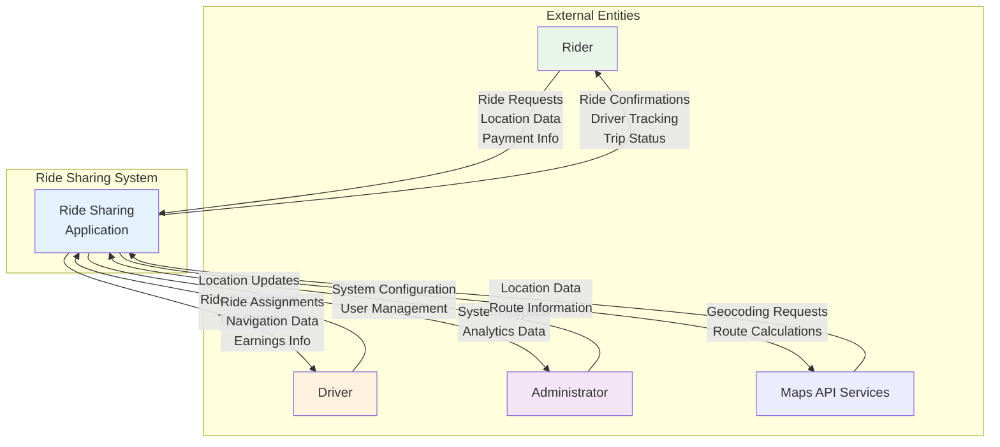
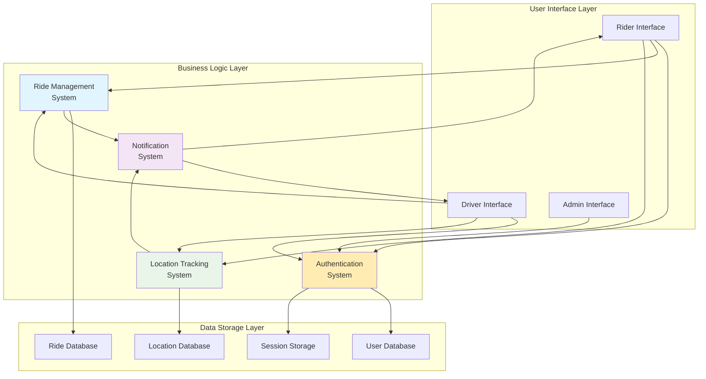
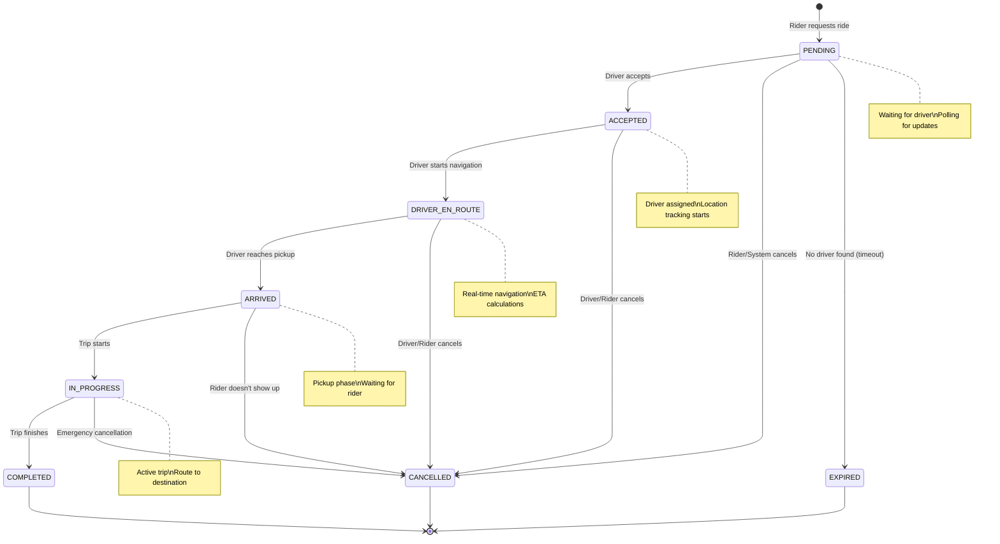
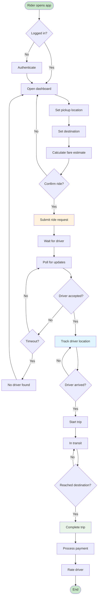
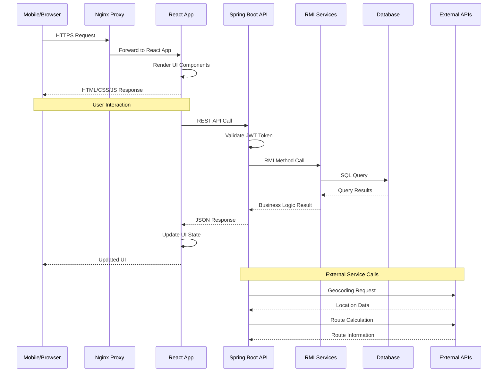
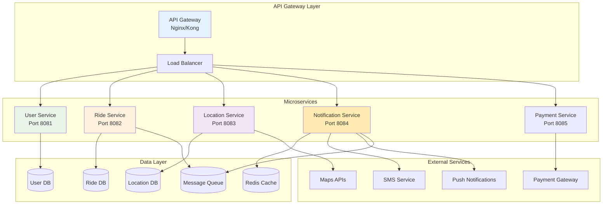
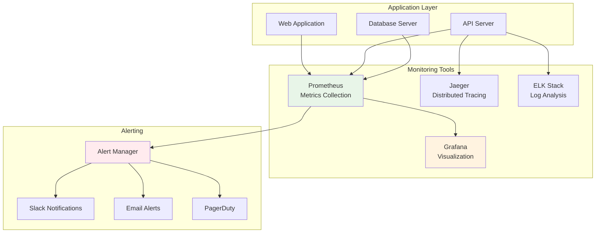
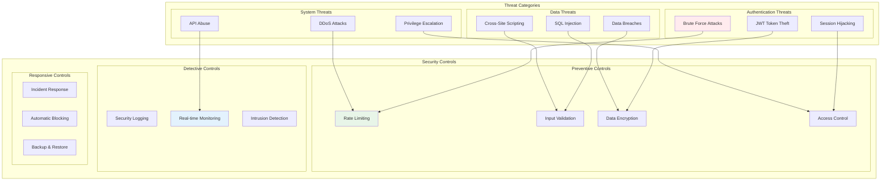

# Technical Analysis Diagrams

Additional detailed diagrams for in-depth technical analysis of the ride-sharing application.

## 1. Data Flow Diagram (Level 0 - Context Diagram)



## 2. Data Flow Diagram (Level 1 - System Breakdown)



## 3. State Transition Diagram (Ride Status)



## 4. Class Diagram (Core Entities)

```mermaid
classDiagram
    class User {
        -Long id
        -String username
        -String phone
        -String password
        -UserType userType
        -Boolean isAvailable
        -Double rating
        -String vehicleType
        -String vehicleNumber
        -LocalDateTime createdAt
        -LocalDateTime updatedAt
        +login(phone, password)
        +updateLocation(location)
        +setAvailability(available)
    }
    
    class Ride {
        -Long id
        -Long riderId
        -Long driverId
        -Double pickupLatitude
        -Double pickupLongitude
        -String pickupAddress
        -Double destinationLatitude
        -Double destinationLongitude
        -String destinationAddress
        -RideStatus status
        -Double estimatedFare
        -Double actualFare
        -LocalDateTime createdAt
        -LocalDateTime updatedAt
        -LocalDateTime completedAt
        +calculateEstimatedFare()
        +updateStatus(status)
        +assignDriver(driverId)
        +complete()
    }
    
    class UserLocation {
        -Long id
        -Long userId
        -Double latitude
        -Double longitude
        -String address
        -Boolean isOnline
        -LocalDateTime lastUpdated
        +updateLocation(lat, lng)
        +getDistance(otherLocation)
        +isRecent()
    }
    
    class Driver {
        -String vehicleType
        -String vehicleNumber
        -Boolean isOnDuty
        -Location currentLocation
        +acceptRide(rideId)
        +updateRideStatus(status)
        +getAvailableRides()
    }
    
    class Rider {
        -List~Ride~ rideHistory
        +requestRide(pickup, destination)
        +cancelRide(rideId)
        +trackDriver(rideId)
    }
    
    User <|-- Driver
    User <|-- Rider
    User ||--o{ UserLocation : has
    User ||--o{ Ride : participates
    Ride ||--|| RideStatus : has
    
    <<enumeration>> UserType
    UserType : RIDER
    UserType : DRIVER
    
    <<enumeration>> RideStatus
    RideStatus : PENDING
    RideStatus : ACCEPTED
    RideStatus : DRIVER_EN_ROUTE
    RideStatus : ARRIVED
    RideStatus : IN_PROGRESS
    RideStatus : COMPLETED
    RideStatus : CANCELLED
```

## 5. Activity Diagram (Ride Request Process)



## 6. Network Communication Diagram



## 7. Microservices Architecture (Future Scaling)



## 8. Performance Monitoring Architecture



## 9. Security Threat Model



## 10. Deployment Pipeline

```mermaid
graph LR
    subgraph "Development"
        DEV_CODE[Developer Code]
        GIT_COMMIT[Git Commit]
        PULL_REQUEST[Pull Request]
    end
    
    subgraph "CI/CD Pipeline"
        BUILD[Build & Test]
        SECURITY_SCAN[Security Scan]
        QUALITY_GATE[Quality Gate]
        DOCKER_BUILD[Docker Build]
        REGISTRY[Container Registry]
    end
    
    subgraph "Deployment Environments"
        DEV_ENV[Development<br/>Environment]
        STAGING[Staging<br/>Environment]
        PROD[Production<br/>Environment]
    end
    
    subgraph "Monitoring"
        HEALTH_CHECK[Health Checks]
        METRICS[Metrics Collection]
        ALERTS[Alerts & Notifications]
    end
    
    DEV_CODE --> GIT_COMMIT
    GIT_COMMIT --> PULL_REQUEST
    PULL_REQUEST --> BUILD
    BUILD --> SECURITY_SCAN
    SECURITY_SCAN --> QUALITY_GATE
    QUALITY_GATE --> DOCKER_BUILD
    DOCKER_BUILD --> REGISTRY
    
    REGISTRY --> DEV_ENV
    DEV_ENV --> STAGING
    STAGING --> PROD
    
    PROD --> HEALTH_CHECK
    HEALTH_CHECK --> METRICS
    METRICS --> ALERTS
    
    style BUILD fill:#e8f5e8
    style SECURITY_SCAN fill:#ffecb3
    style PROD fill:#e3f2fd
    style ALERTS fill:#ffebee
```



---

## Academic Evaluation Criteria Addressed

### 1. **System Analysis & Design**
- Comprehensive data flow diagrams
- Entity relationship modeling
- State transition analysis
- Activity flow documentation

### 2. **Software Architecture**
- Multi-tier architecture design
- Component interaction modeling
- Service-oriented design principles
- Scalability considerations

### 3. **Technology Integration**
- Modern full-stack development
- Database design and optimization
- External API integration
- Real-time communication implementation

### 4. **Security Implementation**
- Threat modeling and analysis
- Multi-layer security approach
- Authentication and authorization
- Data protection strategies

### 5. **Performance & Scalability**
- Monitoring and observability
- Microservices architecture planning
- Load balancing considerations
- Performance optimization strategies